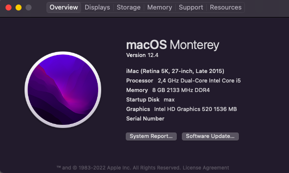

# HP 246 G5 - Intel Core i5-6200U com Intel HD Graphics 520

**Latest working macOS**: 12.4
 
**Current OpenCore**: 0.8.0

## Complete hardware specs
- Intel Core i5-6200U
- HP 81DB Motherboard
- Intel HD Graphics 520
- DDR4 8 GB
- Intel Dual Band Wireless-AC 3165 802.11 ac (kexts not working)
- Crucial BX500 SSD 240 GB

## What works
- macOS Big Sur and macOS Monterey
- Audio
- Sleep
- All USB ports
- 1x 2.5Gbit Ethernet (RTL8125E)
- 1x Gbit Ethernet (Intel 82576)
- Native Keyboard
- Trackpad
- Everything iCloud related (Drive, iMessage, Facetime, etc)
- Shutdown/Reboot/Update to newer macOS builds over time

## What doesn't work
- HDMI/DP
- Wifi 
- Bluetooh

## Kexts used:
- AppleALC.kext (id = 4)
- RealtekRTL8111.kext
- Lilu.kext
- VirtualSMC.kext
- WhateverGreen.kext
- VoodooPS2Keyboard.kext
- VoodooPS2Trackpad.kext

## Thanks/Credits
- [Opencore Team](https://dortania.github.io/getting-started/)
- [Gabriel Luchina - Universo Hackintosh](https://www.youtube.com/c/GabrielLuchina/videos)
- [BASE EFI AMD - Ryzen and Threadripper (1XXX, 2XXX, 3XXX, 4XXX, 5XXX)](https://github.com/luchina-gabriel/BASE-EFI-AMD-RYZEN-THREADRIPPER)

## Discord - Universo Hackintosh
- [Access Discord](https://discord.universohackintosh.com.br)
